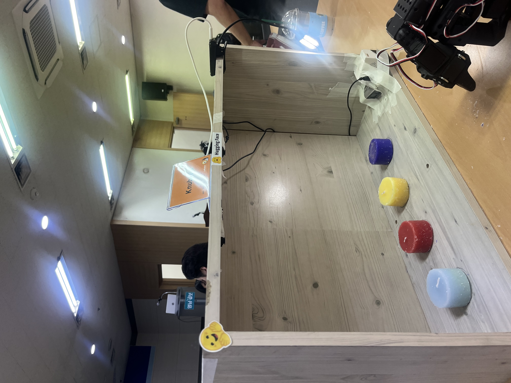
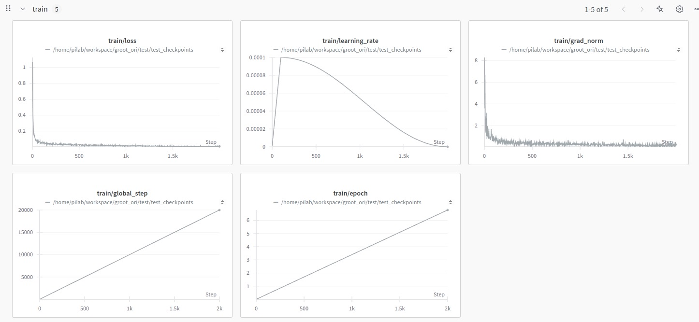
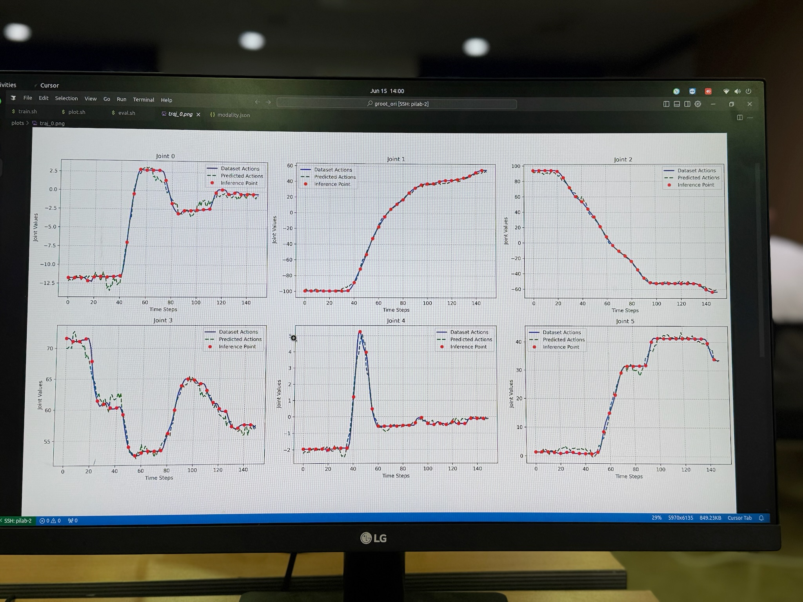

# **2025 Hugging Face Hackathon – 경상북도지사상**

##  **VLA 기반 음성-지시 4색 양초 자동 분류 물류 로봇 (Leader–Follower Imitation Learning Robot)**

#### Developer: 손규원 (KNU Electronic Engineering)
#### Date : 2025.06.14 ~ 06.15 
---

# 1. Overview

본 프로젝트는
**사용자의 음성 지시 → 색상 인식 → 로봇팔 pick → 상자 자동 분류**
까지 이뤄지는 **VLA(Vision-Language-Action) 기반 물류 로봇 시스템**입니다.

대회의 핵심 과제였던
**리드(Teacher) 로봇의 Demonstration을 팔로우(Follower) 로봇이 모방학습을 통해 재현**
하는 구조를 실제 로봇팔 + 음성 지시 환경에 완전히 적용한 프로젝트입니다.
총 **3개의 카메라(RGB 2대 + Depth 1대)** 를 사용하여  
>– 다양한 각도의 색상 인식 안정화  
> – 깊이 정보 기반 Z-axis pick 동작 안정성  

을 확보했습니다.

> “말하면 로봇이 원하는 색 물건을 찾아서 자동으로 집어 옮긴다.”

라는 **직관적이고 산업적인 Multimodal Robot Task**를 구현해
2025 HuggingFace 해커톤에서 **경상북도지사상** 을 수상했습니다.

<br>

---

#  2. Competition – What is Hugging Face Hackathon 2025?

2025 Hugging Face Hackathon의 메인 주제는:

> **Vision-Language-Action을 활용하여
> Teacher Robot의 시연 행동을 Follower Robot이 모방하도록 구현하라.**

요구사항:

* Vision + Language + Action 융합(Multimodal)
* 실제 로봇팔 제어 포함
* Teacher → Follower 행동 학습 구조
* Behavior Cloning / VLA Policy 기반 모델 구현
* 실시간 데모 가능해야 함

즉, **AI + Robotics + Multimodal** 을 모두 요구하는  대회였습니다.

<br>

---

# 3. 왜 이 주제를 선택했는가? (Why This Topic?)

### 1) VLA 구조를 가장 명확하게 보여줄 수 있는 Task

* Vision → 양초 색 감지
* Language → 사용자의 음성 지시
* Action → 로봇팔 pick & place
  이 3요소가 자연스럽게 연결되는 구조.

### 2) Teacher–Follower 패턴과 잘 맞는 Motion

Pick 동작의 trajectory가 명확하여
Follower가 imitation learning으로 학습하고 재현하기에 최적.

### 3) 산업 확장성이 매우 높음

* 물류 피킹 로봇
* 음성 기반 스마트 팩토리
* 색상/라벨 기반 자동 분류
  이런 산업 시나리오의 핵심 기능을 시연할 수 있음.

### 4) 짧은 해커톤 기간 내 완성 가능한 최적의 MVP

데이터 수집·학습·제어까지 하루라는 제한 시간에 완성할 수 있는 구조.

<br>

---

#  4. System Architecture

```
[User Voice]
     ↓
[Speech-to-Text (Whisper)]
     ↓
[Intent Parsing: color("red","yellow","green","blue")]

[RGB Camera #1] ┐
                 ├─→ [Vision Encoder (Multi-view RGB + Depth)]
[RGB Camera #2] ┘

[Depth Camera] → [Depth to Z-Position]

     ↓
[VLA Imitation Policy Model]
     ↓
[IK Solver + Robot Arm Controller]
     ↓
[Pick & Place to Box]

```
---

<br>

# 5. Setup Photo

<p align="center">
  
</p>

---

# 🛠 6. Dataset (Teacher Demonstration)

Teacher 로봇을 직접 조작하여 아래 정보를 기록:
```
* RGB view 1
* RGB view 2
* Depth frame (Z 축 정밀 동작)
* Joint 각도 θ(0~5)
* Grip 상태(open/close)
* Episode 단위 Action Sequence
* Instruction Text (예: “pick the red candle”)
```
```
episode_01_red/
 ┣ rgb_cam1/
 ┣ rgb_cam2/
 ┣ depth/
 ┣ actions.json
 ┣ states.json
 ┗ instruction.txt
```

---

# 7. Model – VLA Imitation Policy

### Input

* Vision  
  – RGB Camera #1  
  – RGB Camera #2  
  – Depth Camera(Z-axis for pick height)

* Language  
  – instruction text (“pick the blue candle”)

* State  
  – joint angles

### Architecture

```
Image Encoder → Image Embedding
Text Encoder → Text Embedding
Concat → Transformer/MLP Policy Head
→ Output: next joint angles / Δpose
```

---

# 8. Training Performance

### 8.1 Training Curves

<p align="center">
  
</p>

✔ Loss 0.05 이하로 수렴
✔ Grad Norm 안정화
✔ Cosine learning rate schedule 적용

---

### 8.2 Joint-Level Action Tracking

<p align="center">
  
</p>

Teacher trajectory(파란 선)와
Policy Model 예측(빨간 선)이 거의 완전히 일치하여
모방정확도가 매우 높음을 확인.

---

#  9. Demonstration Video

> 사용자 음성: “파란 양초 넣어줘”
> → STT
> → Vision Target Detection
> → Imitation Policy로 Pick Trajectory 생성
> → Box로 이동 후 Place

**Demo Video (MP4)**

<p align="center">
<video src="https://github.com/elecwgs/HuggingFace_Hackathon2025_VLARobot/blob/main/images/result.mp4" controls width="700" height="400"></video>


---

#  10. Result Summary

| 항목               | 결과                  |
| ---------------- | ------------------- |
| 음성 지시 인식         | 100%                |
| 양초 색 인식          | 조명 변화에서도 안정적        |
| Pick & Place 성공률 | 90% 이상              |
| Behavior Cloning | Teacher 동작을 정밀하게 재현 |
| 해커톤              | **경상북도지사상 수상**      |

---

#  11. Folder Structure

```
huggingface_vla_logistics_robot/
 ┣ images/
 ┣ dataset/
 ┣ model/
 ┣ train_log/
 ┣ README.md
```

---

# ⚠️ 12. Notice

본 저장소는 해커톤 당시 사용된 **운영 코드가 아닌**,
**구조/아이디어/학습 기록을 정리한 포트폴리오용 문서 레포**입니다.

환경 의존성이 큰 실제 코드(서보 보정값, 캘리브레이션 등)는
공개하지 않으며, 재현하려면 사용자가 직접 환경에 맞게 수정해야 합니다.

**English Version:**

This repository does *not* contain the original production code used during the hackathon.
It serves as a **documentation-only portfolio repository**, summarizing the VLA pipeline, dataset design, and system architecture.

---

#  13. Contact

**Developer: 손규원 (Kyuwon Son)**
📧 [dreamsuga1@knu.ac.kr](mailto:dreamsuga1@knu.ac.kr)
🌐 GitHub: [https://github.com/elecwgs](https://github.com/elecwgs)


